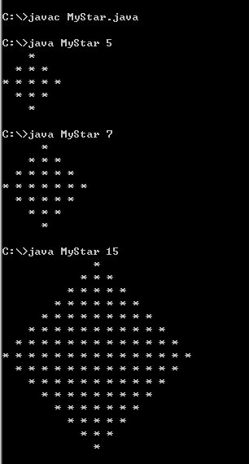

## 实验一
- Java开发环境配置（打印动态菱形）

一、实验目的通过本次实验使学生掌握基本的java编译运行环境，掌握循环、输出等技术的用法。

二、实验内容
> 给定一个奇数n，输出一个n行的菱形，如图：
> 

三、实验要求完成满足实验内容的Java代码

四、编程题
> 1. 打印出所有的“水仙花数”，所谓“水仙花数”是指一个三位数，其各位数字立方和等于该数本身。
例如：153是一个“水仙花数”，因为153=13+53+33。
> 
>
> 2. 编写一个代表三角形的类。其中，三条边为三角形的属性，并封装有三角形的面积和周长的方法,并设计构造方法.
>
>
> 3. 测试数据：分别对三条边为3，4，5和7，8，9的两个三角形进行测试。
