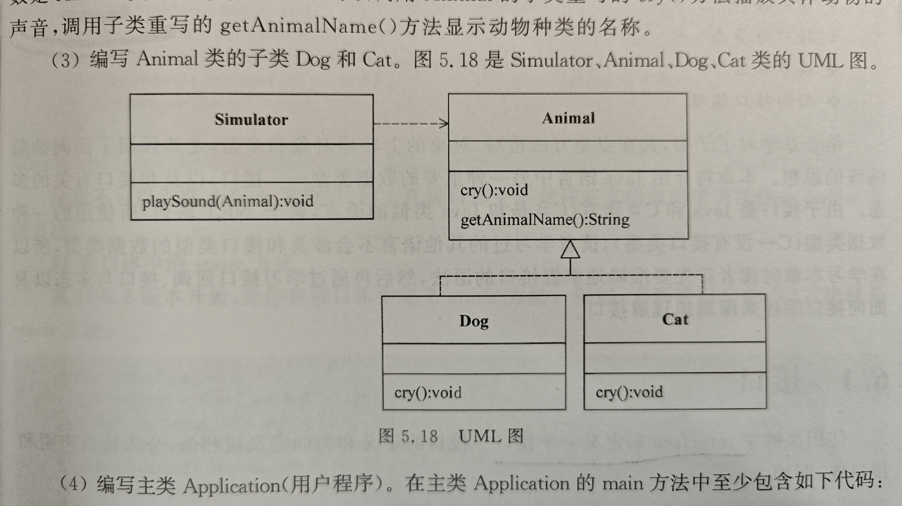

# Java第六次作业
> @author **uncle yumo**
> <br />
> @time 2024/4/4
## 第一题
**编写抽象类 Animal**
<br />
Animal类有两个抽象方法:
> `cry()`和`getAnimalName()`
<br />
> 即: 要求各种具体的动物给出自己的叫声和种类名称。

## 第二题
**编写模拟器类Simulator**
<br />
该类有一个`playSound(Animal animal)`方法:
<br />
> 该方法的参数是Animal类型，即参数animal可以调用Animal的子类重写的`cry()`方法播放具体动物的声音，调用子类重写的```getAnimalName()```方法显示动物种类的名称

# 第三题
**编写 Animal类的子类Dog和Cat**<br />
图5.18是Simulator、Animal、Dog、Cat 类的UML图:
> 
> 图5.18 UML图

## 第四题
**编写主类 Application(用户程序)**
<br />
在主类Application的`main方法`中至少包含如下代码:
<br />
```
Simulator simulator = new Simulator();
simulator.playSound(new Dog());
simulator.playSound(new Cat());
```